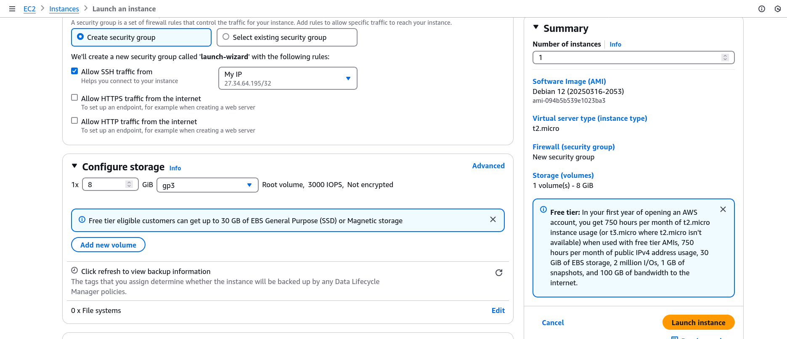
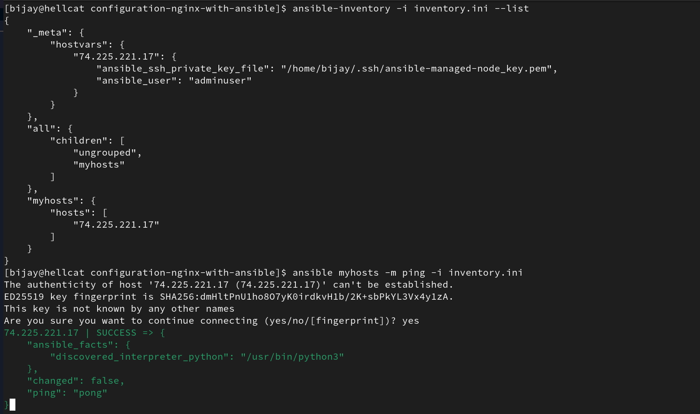
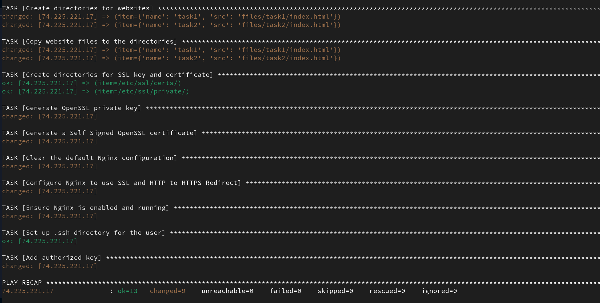
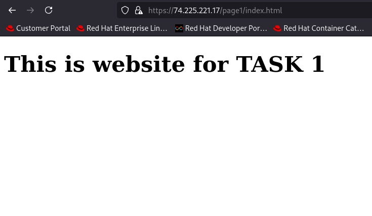
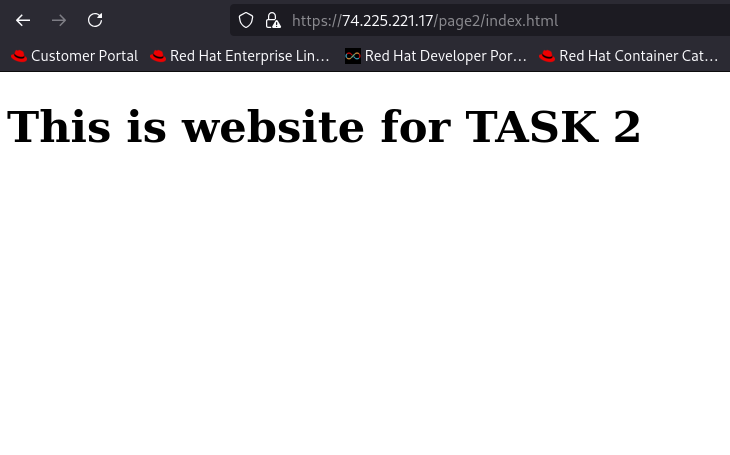

# configuration-nginx-with-ansible
This repository contains documentation and snippets on how to configure nginx web server with Ansible.

## Launching an EC2 instance in AWS with available AMIs.
I launched an `t2.micro` EC2 instance in AWS cloud.



## Create Ansible Inventoy
Ansible inventory is a collection of nodes or machines to be managed by ansible. Inventories can be defined in either `inventory.ini` or `inventory.yaml` file. Since our requirement is small scale with just single machine, I went with `inventory.ini`.
I added public IP address, username and private key location in inventory file.

### Verifying inventory

```bash
$ ansible-inventory -i inventory.ini --list

$ ansible myhosts -m ping -i inventory.ini

```




## Ansible Playbook
Ansible playbook is a collection of plays, where each play consists of multiple tasks for configuring the systems.
Task is a reference to a single module that defines the operations that Ansible performs, and module is a unit of code or binary that Ansible runs on managed nodes.

> [!Important]
> Here we have tasks in each play (inside `plays/` directory).We import these plays into main `playbook.yml` file and run with Ansible.

### Update the systems (`system-update.yml` play)
To update the system packages, I used the `apt` module in Ansible, specifying to update the cache and upgrade all packages to their latest version.

```yaml
- name: Update system
  apt:
    update_cache: yes
    upgrade: dist
```

### Installing Nginx (`install-nginx.yml` play)
To install the nginx, I used the `shell` module in Ansible, and run commands to clone my first task repository and execute `install-nginx.sh` script.

```yaml
- name: Install Nginx
  shell:
    cmd: git clone https://github.com/bijay-05/react-app-deployment-github-runner.git && bash react-app-deployment-github-runner/install-nginx.sh
```

### Create directories for Websites (`setup-websites.yml` play)
In order to create directories, I used the `file` module and to copy website files, `copy` module was used.

```yaml
- name: Setup files for Websites
  become: true
  vars:
    websites:
      - name: "task1"
        src: "files/task1/index.html"
      - name: "task2"
        src: "files/task2/index.html"
  block:
    - name: Create directories for websites
      file:
        path: "/var/www/html/{{ item.name }}"
        state: directory
      loop: "{{  websites }}"
    - name: Copy website files to the directories
      copy: 
        src: "{{ item.src }}"
        dest: "/var/www/html/{{ item.name }}/index.html"
```
### Configure HTTPS (`config-ssl.yml` play)
For HTTPS configuration and generating SSL certificates automatically, I used `openssl_privatekey`, `openssl_certificate` modules to generate SSL keys and certificates. And in order to re-configure nginx configuration, `replace` and `blockinfile` modules are used.


### Adding SSH Public Key for User Authentication (`ssh.yml` play)
Now, I created new SSH public and private key pair. For adding the public key to the user on ansible managed machine, I used `file` and `authorized_key` modules.


### Final Ansible Playbook (`playbook.yml`)

```yaml
- hosts: myhosts
  become: true
  tasks:
    - import_tasks: plays/system-update.yml
    - import_tasks: plays/install-nginx.yml
    - import_tasks: plays/setup-websites.yml
    - import_tasks: plays/config-ssl.yml
    - import_tasks: plays/ssh.yml
```

## Ansible Playbook Run Success

```bash
$ ansible-playbook -i inventory.ini playbook.yml
```

> [!Caution]
> While running above command, Ansible threw **error: missing modules or misspelling for several modules related to openssl and ssh**. I installed modules with `ansible-galaxy collection install community.crypto ansible.posix` and everything worked fine.




## viewing Websites






> [!Caution]
> I faced one major issue while viewing the website. The `/etc/nginx/sites-available/default` file configured by Ansible was not included in main `nginx.conf` file. So I had to manually enter the line `include /etc/nginx/sites-available/*;` in `nginx.conf` file. After that I checked nginx configuration with `sudo nginx -t` and reloaded the nginx service. After that everything worked fine. Actually, this issue was caused because I was installing and configuring the nginx using `install-nginx.sh` script from task 1. I have updated the bash script in task 1 as well.


## SSH with new_key


